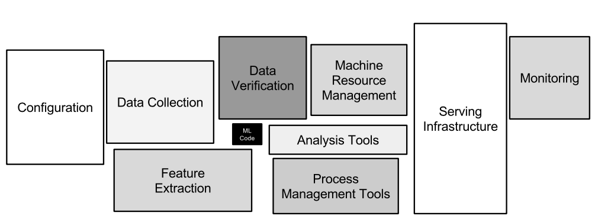

# forecasting-ml
Tutorial for forecasting using machine learning

1. Introduction
2. Single-series forecast
3. Feature engineering
4. Machine learning
5. Production

### Requirements
- pandas
- keras
- tensorflow
- h2o
- scikit-learn

### 1. Introduction

### 2. Single-series forecast
1. AR
2. ARMA
3. ARIMA
4. SARIMA
5. Holt-Winters
6. Prophet

### 3. Feature engineering

### 4. Machine Learning

### 5. Production

### References
- https://papers.nips.cc/paper/5656-hidden-technical-debt-in-machine-learning-systems.pdf
